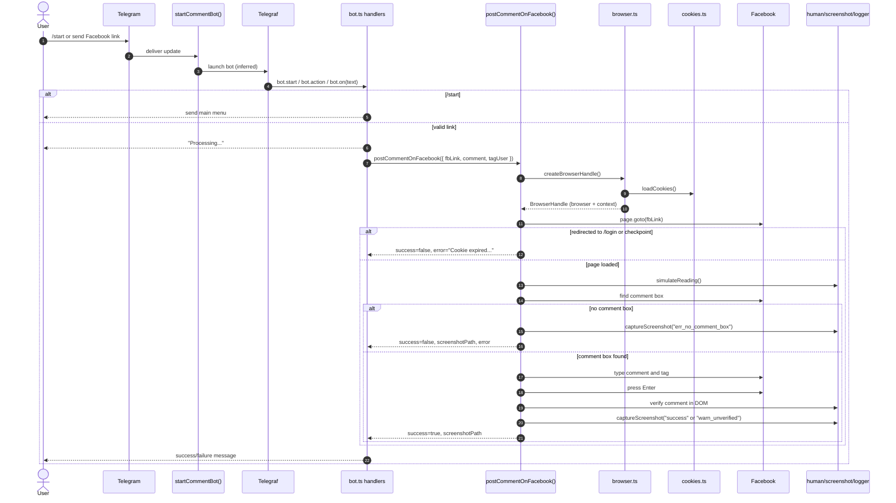

# c6tool

`c6tool` is a Telegram bot that automatically posts a Facebook comment using Playwright.
The current code flow is intentionally simple:

1. A user opens the Telegram bot.
2. Sends a Facebook post link.
3. The bot opens the post in Playwright and loads login cookies from a JSON file.
4. The bot posts a fixed comment and tags a fixed account.
5. The bot returns the result to Telegram and saves a screenshot for debugging when needed.

---

## Current Features

- Simple Telegram bot with inline buttons.
- Accepts a Facebook link directly from chat.
- Automated Facebook commenting with Playwright.
- Fixed tag target defined in code.
- Cookie-based session loading.
- Post-comment verification.
- Screenshot capture for errors or debugging.

---

## How It Works

### 1. Start the bot

The entry point is [`src/main.ts`](./src/main.ts). It only calls `startCommentBot()`.

The bot requires this environment variable:

- `BOT_TOKEN`

If `BOT_TOKEN` is missing, the app exits during startup.

### 2. Interact with the Telegram bot

When the user sends `/start`, the bot will:

- create an in-memory session for the current chat,
- greet the user,
- show the main menu.

The main menu currently contains a single button:

- `Enter Post Link` (actual button text: `Nhập Link Bài Viết`)

The user can also send a Facebook link directly, as long as it starts with `http://` or `https://`.

If the user sends anything else, the bot shows the main menu again.

### 3. Handle the link

After receiving a valid link, the bot will:

- reply that it is processing the request,
- call `postCommentOnFacebook()` from [`src/playwright/commenter.ts`](./src/playwright/commenter.ts),
- use the default comment and default tag from [`src/constants/constants.ts`](./src/constants/constants.ts).

### 4. Playwright browser flow

The current Playwright flow is:

1. Launch Chromium in `headless` mode.
2. Create a browser context with fixed settings.
3. Load cookies from [`src/playwright/facebook_cookies.json`](./src/playwright/facebook_cookies.json).
4. Open the Facebook post.
5. Check for `/login` or `checkpoint` redirects to detect expired cookies.
6. Scroll the page a bit to simulate reading behavior.
7. Find the comment input using multiple fallback selectors.
8. Type the comment.
9. Type `@`, enter the tag name, and select the suggestion if Facebook shows one.
10. Submit the comment with `Enter`.
11. Wait for the comment text to appear in the DOM.
12. Capture a screenshot.
13. Close the browser.

### 5. Return value

- On success, the bot returns a success message and may include the screenshot path.
- On failure, the bot returns a clear error message such as:
  - comment box not found,
  - cookie expired or checkpointed,
  - navigation error,
  - UI interaction error.

Notes:

- If the comment is submitted but not confirmed in the DOM, the code still returns `success: true`, but the screenshot is saved with the `warn_unverified` label.
- If no comment box is found, the bot captures an error screenshot and returns failure.

---

## Sequence Diagram

This diagram follows the actual flow in [`src/main.ts`](./src/main.ts), [`src/bot/bot.ts`](./src/bot/bot.ts), and [`src/playwright/commenter.ts`](./src/playwright/commenter.ts).



---

## Class Diagram

This diagram shows the main modules, interfaces, and dependencies in the current codebase.

```mermaid
classDiagram
    direction LR

    class Main {
      +main(): Promise<void>
    }

    class BotModule {
      -bot: Telegraf
      -userSessions: Map<string, UserSession>
      +startCommentBot(): Promise<void>
      -sendMainMenu(ctx): Promise<void>
      -runJob(ctx, fbLink): Promise<void>
    }

    class UserSession {
      +step: "idle" | "waiting_link"
    }

    class Env {
      +botToken: string
    }

    class Commenter {
      +postCommentOnFacebook(job: CommentJob): Promise<CommentResult>
      -findCommentBox(page)
      -verifyCommentPosted(page, comment): Promise<boolean>
      -isAuthFailure(url): boolean
    }

    class BrowserModule {
      +createBrowserHandle(): Promise<BrowserHandle>
      +closeBrowserHandle(handle): Promise<void>
    }

    class BrowserHandle {
      +browser: Browser
      +context: BrowserContext
    }

    class CookiesModule {
      +loadCookies(): Cookie[]
      -normalizeOne(raw): Cookie
    }

    class HumanModule {
      +sleep(ms): Promise<void>
      +sleepRandom(range): Promise<void>
      +simulateReading(page): Promise<void>
      +humanType(el, text): Promise<void>
    }

    class ScreenshotUtil {
      +captureScreenshot(page, label): Promise<string>
    }

    class Logger {
      +info(message): void
      +ok(message): void
      +warn(message): void
      +error(message): void
      +step(message): void
    }

    class Constants {
      +DEFAULT_COMMENT: string
      +TARGET_TAG_NAME: string
      +COOKIES_PATH: string
      +SCREENSHOT_DIR: string
      +COMMENT_BOX_SELECTORS: readonly string[]
      +AUTH_FAILURE_PATTERNS: readonly string[]
    }

    class CommentJob {
      +fbLink: string
      +comment: string
      +tagUser?: { uidOrName: string }
    }

    class CommentResult {
    }

    class RawCookie {
      +name: string
      +value: string
      +domain: string
      +path?: string
      +secure?: boolean
      +httpOnly?: boolean
      +sameSite?: string
      +expirationDate?: number
    }

    Main --> BotModule : calls
    BotModule --> Env : reads
    BotModule --> Commenter : calls
    BotModule --> UserSession : stores

    Commenter --> BrowserModule : creates/closes
    Commenter --> BrowserHandle : uses
    Commenter --> HumanModule : simulates input
    Commenter --> ScreenshotUtil : captures
    Commenter --> Logger : logs
    Commenter --> Constants : selector/timeouts
    BrowserModule --> CookiesModule : loads
    CookiesModule --> RawCookie : normalizes
    BrowserModule --> Constants : browser/context options

    CommentJob --> Commenter : input
    Commenter --> CommentResult : output
```

---

## Required Configuration

### 1. `BOT_TOKEN`

Create a `.env` file in the project root:

```env
BOT_TOKEN=123456:ABC-DEF...
```

### 2. Facebook cookies

The code reads cookies from:

```txt
src/playwright/facebook_cookies.json
```

This file must be a valid JSON array of cookies.
The repository includes a sample file:

- [`src/playwright/facebook_cookies.example.json`](./src/playwright/facebook_cookies.example.json)

Copy the sample and replace it with real cookies from the Facebook account you want to use.

If the file does not exist or the JSON is invalid, the bot will fail when it reaches the comment execution step.

### 3. Default comment and tag

The current text is hardcoded in the code:

- comment: [`DEFAULT_COMMENT`](./src/constants/constants.ts)
- tag: [`TARGET_TAG_NAME`](./src/constants/constants.ts)

To change the comment or the tag, update the constants file and rebuild the app.

---

## Installation and Run

```bash
npm install
```

If Playwright browsers are not installed yet, run:

```bash
npx playwright install
```

Run in development mode:

```bash
npm run dev
```

Build the project:

```bash
npm run build
```

Run the built app:

```bash
npm start
```

Check code quality:

```bash
npm run check
```

---

## Usage Example

1. Create `.env` with `BOT_TOKEN`.
2. Put Facebook cookies into `src/playwright/facebook_cookies.json`.
3. Run `npm run dev`.
4. Open the Telegram bot and send `/start`.
5. Click `Enter Post Link` or paste a Facebook post link.
6. Wait for the result message.

---

## Project Structure

```txt
src/
├── bot/                 # Telegram bot and link handling flow
├── config/              # Environment variable loading
├── constants/           # Timeouts, selectors, default comment/tag
├── playwright/          # Browser, cookies, and Facebook automation
├── types/               # TypeScript types
├── utils/               # Logger and screenshot utilities
└── main.ts              # Entry point
```

Screenshots are saved in:

```txt
src/constants/screenshots/
```

---

## Important Notes

- The current bot does not have a separate backend API.
- The current bot does not use a queue or job system.
- The current bot does not provide comment templates.
- Facebook session persistence is handled by the cookie JSON file, not by a persistent browser profile.
- The browser always runs in `headless: true` mode.

---

## Code References

- [`src/main.ts`](./src/main.ts)
- [`src/bot/bot.ts`](./src/bot/bot.ts)
- [`src/config/env.ts`](./src/config/env.ts)
- [`src/playwright/commenter.ts`](./src/playwright/commenter.ts)
- [`src/playwright/browser.ts`](./src/playwright/browser.ts)
- [`src/playwright/cookies.ts`](./src/playwright/cookies.ts)
- [`src/constants/constants.ts`](./src/constants/constants.ts)
