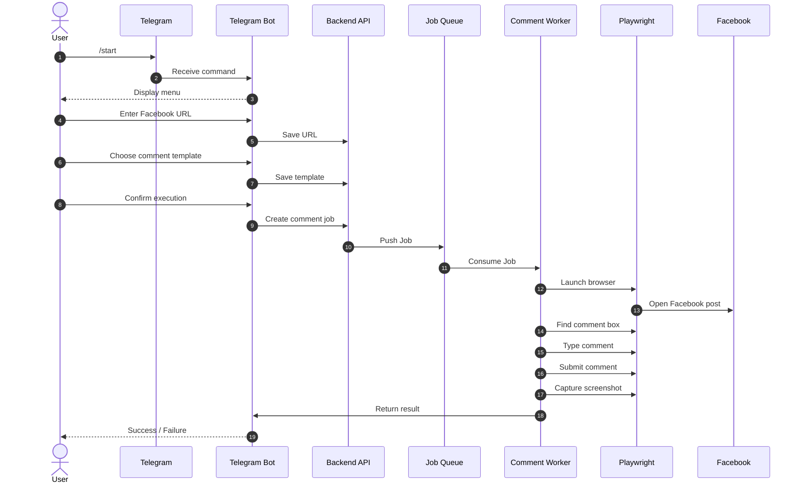
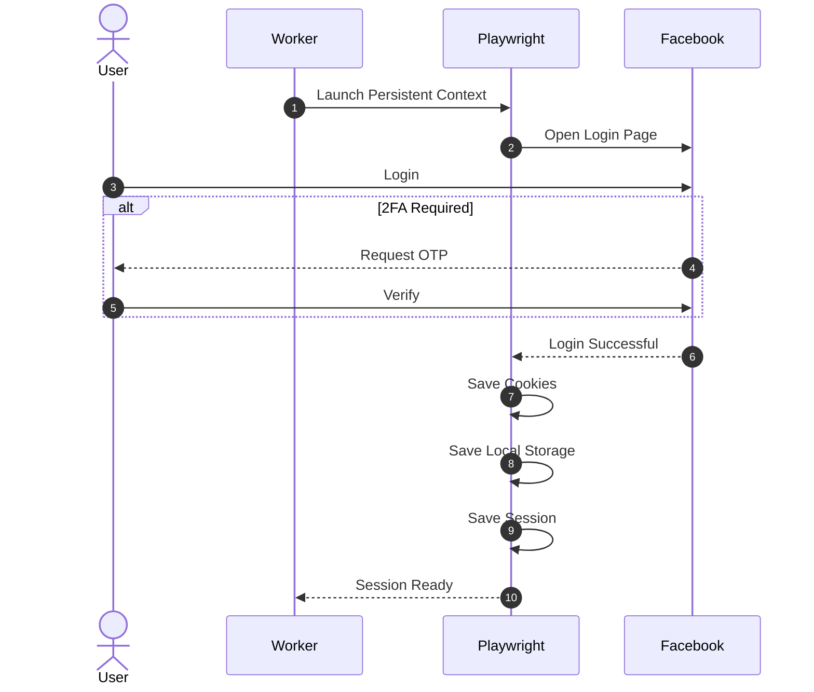
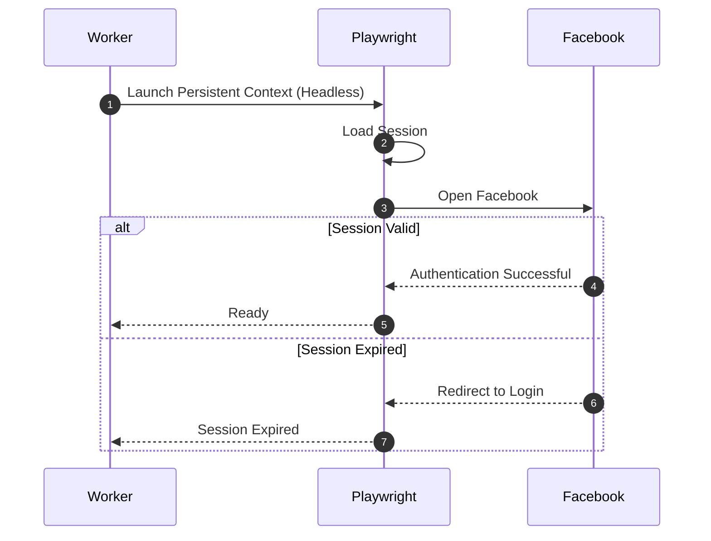

# Facebook Auto Comment Bot(c6tool)

An automation system that allows users to post comments on Facebook posts through a Telegram Bot. The system uses Playwright to control a persistent Facebook session and processes comment requests asynchronously using a job queue.

---

# Features

* Telegram Bot with interactive menu
* Facebook post URL submission
* Configurable comment templates
* Confirmation before execution
* Asynchronous job processing
* Persistent Facebook login session
* Automatic comment posting via Playwright
* Telegram execution notifications
* Screenshot capture for debugging
* Queue-based architecture for scalability

---

# System Architecture

```
                 +----------------+
                 | Telegram User  |
                 +-------+--------+
                         |
                         v
                 +----------------+
                 | Telegram Bot   |
                 +-------+--------+
                         |
                         v
                 +----------------+
                 | Backend API    |
                 +-------+--------+
                         |
                  Create Comment Job
                         |
                         v
                 +----------------+
                 |   Job Queue    |
                 +-------+--------+
                         |
                         v
                 +----------------+
                 | Comment Worker |
                 +-------+--------+
                         |
                  Launch Playwright
                         |
                         v
                 +----------------+
                 |   Facebook     |
                 +----------------+
```

---

# Workflow

## Step 1 – Telegram Bot Interaction

The user starts the Telegram bot by sending the `/start` command.

The bot displays an interactive menu containing the following options:

* Enter Facebook Post URL
* Choose Comment Template
* Review Configuration

The user first submits a Facebook post URL.

Next, the user selects one of the predefined comment templates (or optionally creates a new one).

Finally, the bot displays a configuration summary and asks the user to confirm the execution.

---

## Step 2 – Facebook Session Management

### Initial Login

When running the application for the first time:

* Launch Playwright using a persistent browser context.
* Run the browser in headed mode.
* Log in to Facebook manually.
* Complete two-factor authentication if required.
* Playwright automatically stores:

  * Cookies
  * Local Storage
  * Session data

The session is saved for future executions.

### Subsequent Runs

For all future executions:

* Launch Playwright in headless mode.
* Reuse the previously saved browser profile.
* Skip the Facebook login process entirely.

---

## Step 3 – Auto Comment Execution

After the user confirms the configuration:

1. Create a new comment job.
2. Push the job into the queue.
3. A worker consumes the job.
4. Launch Playwright using the persistent Facebook session.
5. Navigate to the Facebook post.
6. Locate the comment input field.
7. Enter the selected comment.
8. Submit the comment.
9. Wait several seconds to verify that the comment has been posted.
10. Capture a screenshot if needed.
11. Close the browser or reuse the browser context.

---

## Step 4 – Execution Result

After the worker finishes processing:

### Success

The user receives a Telegram notification:

```
✅ Comment posted successfully.

Post:
https://facebook.com/...
```

### Failure

If the execution fails:

* Invalid URL
* Expired Facebook session
* Network error
* Facebook restriction
* Unexpected page layout

The worker captures a screenshot and sends the error details back to the Telegram Bot.

Example:

```
❌ Failed to post comment.

Reason:
Facebook session expired.
```

---

# Sequence Diagrams

## 1. Main Workflow



---

## 2. Initial Facebook Login



---

## 3. Reusing Existing Session



---

# Project Structure

```
project/
│
├── bot/                    # Telegram Bot
├── api/                    # Backend API
├── worker/                 # Queue Worker
├── playwright/             # Facebook automation
├── fb_sessions/            # Persistent browser profiles
├── screenshots/            # Error screenshots
├── comments/               # Comment templates
└── queue/                  # Queue configuration
```

---

# Future Improvements

* Multiple Facebook accounts
* Multiple Telegram users
* Schedule comments
* Bulk comment support
* Proxy rotation
* CAPTCHA detection
* Automatic session refresh
* Admin dashboard
* Comment history
* Retry mechanism
* Metrics and monitoring

---

# Technology Stack

* Node.js
* TypeScript
* Telegram Bot API
* Playwright
* Redis
* MongoDB
* Docker (optional)
